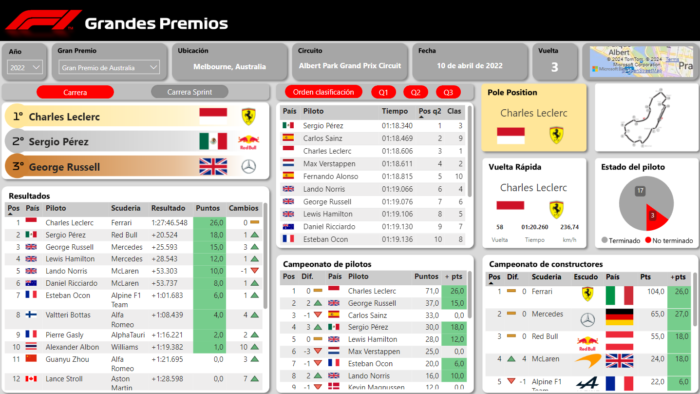
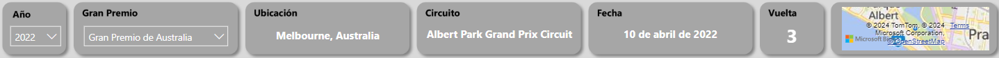
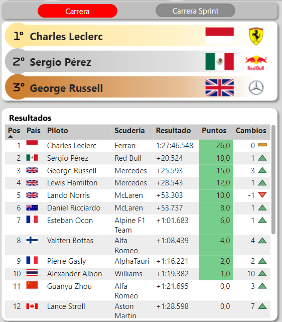
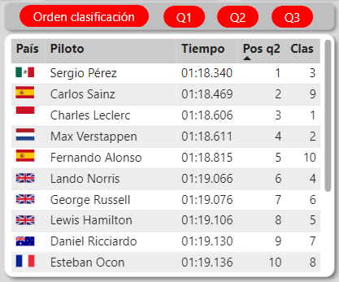
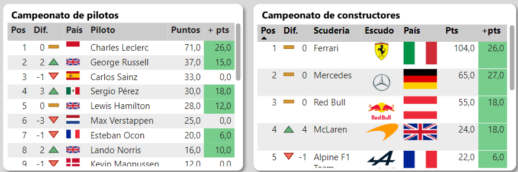
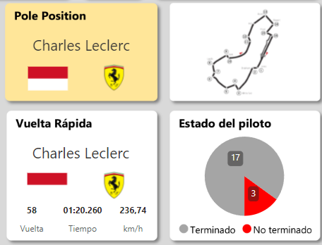

# Dashboard en Power BI
En el dashboard podemos encontrar datos descriptivos sobre cada Gran Premio como el día, hora y lugar en el que fue realizado. Datos numéricos, como las posiciones de la carreras, de las clasificaciones, y los campeonatos tanto de constructores como de pilotos, entre otras cosas que se detallaran a continuación.

## Sectores

#### Descripción
Por debajo del título encontramos el sector descriptivo del gran premio, con información respecto a donde y cuando sucedió la misma.

#### Resultados de la carrera
A la izquierda del Dashboard podemos encontrar los resultados que tuvieron los pilotos en el Gran Premio. En la parte superior observamos que hay dos botones, uno llamado "Carrera" y el otro“Carrera Sprint", el color rojo del botón denota que se puede seleccionar, el color gris significa que no hay información. Se utilizo esta alternativa para aprovechar la misma tabla y el podio cuando exista la carrera Sprint.

#### Clasificación
En la parte media superior se encuentran los datos de la clasificación. Sobre la tabla hay 4 botones, orden de clasificación y q1/2/3, que tienen la misma respuesta de los colores en caso de que exista o no.

#### Campeonatos
En la parte inferior vemos los campeonatos, tanto de pilotos como de constructores. En el encontramos la actualización de dichos campeonatos luego de finalizado el Gran Premio seleccionado.

#### Información y detalles
Por último, en la parte superior derecha, hay variedad de información y descripción relevante sobre la carrera. Como puede ser: el piloto que consiguió la Pole Position, o un gráfico de tortas que detalla la causa de que los pilotos no hayan terminado la carrera.

